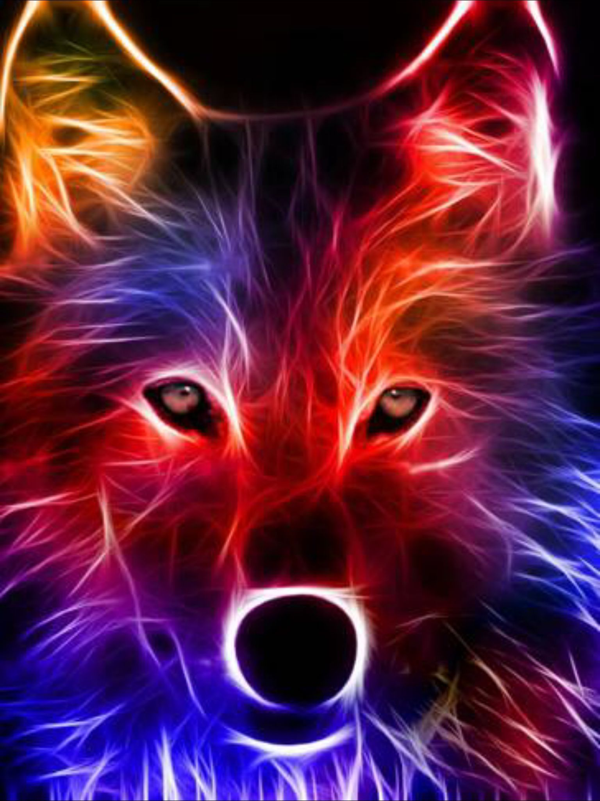

# Ascii-Art
Turns your videos or pictures into ascii equivalents

### Setup
To start the project, install all the necessary requirements.
```shell
pip install -r requirements.txt
```

Then navigate to main.py under src and run
```shell
python main.py
```

Then you can either generate an ascii image or video by selecting the according 
media from your file browser. Note that the ascii video generator currently takes
a long time at low quality and super long at high quality. Multi threading will
be added as the next stage in this project to avoid that

### Example Output
<center>original Image</center>

{:height="50%" width="50%"}

Ascii Image in Color       |  Ascii Image in Black and White
:-------------------------:|:-------------------------:
 |  
